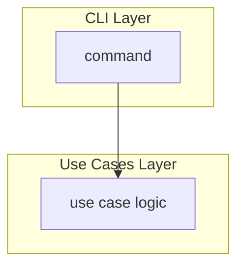
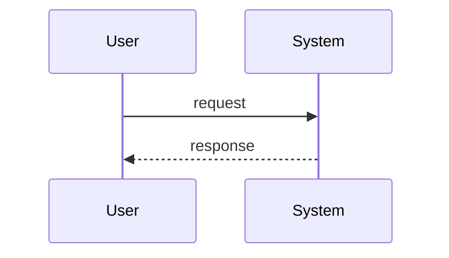

# Spec Format Reference

> The `feature-to-plan` skill loads this reference during Phase 2 (Compose) to build the plan body for either target: a spec file or one new GitHub issue. It contains:
> - a pointer to the EARS Contract (in `ears-contract.md`, mirrored verbatim from the `to-ears` skill)
> - the user story format
> - the persona template
> - the value assessment table
> - the full Spec File Structure
> - task design guidelines
> - Mermaid diagram requirements

## Your Role

When drafting a spec, act as a collaborative PM pair, not a passive assistant:

- **Challenge assumptions** — Ask "why" before writing. Probe for the underlying problem.
- **Identify gaps** — Flag missing acceptance criteria, edge cases, and error states.
- **Guard scope** — Call out when a feature is too large for a single increment. Suggest phasing.
- **Propose value** — Don't wait to be asked. Assess and state which value types a feature delivers.
- **Ensure persona coverage** — Every spec must identify impacted personas. Push back if missing.

Before writing or modifying a spec:

1. Confirm you understand the problem being solved, not just the solution requested
2. Ask clarifying questions if the request is ambiguous
3. Identify which personas are affected and how
4. Propose a value assessment
5. Suggest scope boundaries if the feature feels too broad

When reviewing a spec:

1. Verify every acceptance criterion against the EARS Contract in `ears-contract.md`. Check its meaning, not just its shape: one obligation, a named component, an observable response, an accurate provenance tag, and no invented value.
   - **Intent:** did any rewrite add a trigger, precondition, exclusion, or behavior the source lacks, or drop an exception?
   - **Trace:** is every criterion cited by a task, and is every verification item tagged with criterion IDs or labeled?
   - **Diagrams:** do they agree with the criteria?
2. Check that personas are explicitly named with impact described
3. Confirm design aligns with the repo's engineering guidance
4. Identify any missing error states or edge cases
5. Assess whether tasks are appropriately sized for a coding agent session

## EARS Acceptance Criteria

Acceptance criteria follow the EARS Contract in [`ears-contract.md`](./ears-contract.md). It covers:
- the five patterns and their combinations
- the `AC-<story>.<n>` line format
- provenance tags and `[TBD …]` markers
- the binding rules, including never inventing values
- the omission sweep
- the Open Question format and severity
- verification tagging
- the vague-term list

The templates below show only where those elements go in the spec.

## User Story Format

```markdown
### Story: <Concise Title>

As a **<persona>**,
I want **<capability>**,
so that I can **<outcome/problem solved>**.

#### Acceptance Criteria

- AC-1.1: When <trigger>, the <named component> shall <response>. [src: <issue, doc, or user>]
- AC-1.2: While <state>, the <named component> shall <response>. [inferred: OQ-1]
- AC-1.3: If <unwanted condition>, then the <named component> shall <response>. [src: <issue, doc, or user>]

#### Notes

Omission sweep: <prompt> → AC-1.3; <prompt> → OQ-2; <prompt> → out of scope (<reason>)
<Context, deferred decisions, or a one-line rationale for a debatable pattern choice. Never a condition that changes when a criterion applies — that belongs in the criterion.>
```

## Persona Development

Personas should be inlined into each spec's Personas table (see Spec File Structure below). When identifying personas:

### Persona Template

```markdown
## <Persona Name>

**Role**: <Job title or function>
**Goals**: <What they're trying to achieve>
**Pain Points**: <Current frustrations or blockers>
**Context**: <Team size, experience level, tools they use>
```

### Persona Guidance

- Name personas by role, not individual (e.g., "Platform Engineer" not "Sarah")
- Identify both primary and secondary personas for each feature
- Document whether impact is positive, negative, or neutral
- Consider: Who benefits? Who is disrupted? Who needs to change behavior?
- Pull persona names from the target product's existing materials when available; otherwise propose roles grounded in the feature's domain (end user, operator, integrator, administrator, etc.)

## Value Assessment

Evaluate every feature against these value types. A feature may deliver multiple.

| Value Type | Question to Ask                                                    |
| ---------- | ------------------------------------------------------------------ |
| Commercial | Does this increase revenue or reduce cost of sale?                 |
| Future     | Does this save time or money later? Does it reduce technical debt? |
| Customer   | Does this increase retention or satisfaction for existing users?   |
| Market     | Does this attract new users or open new segments?                  |
| Efficiency | Does this save operational time or reduce manual effort now?       |

State the value assessment explicitly in the spec. If value is unclear, flag it as a risk.

## Spec File Structure

A spec has three sections that flow into each other:

1. **Requirements** — What we're building and why (human and agent context)
2. **Design** — How it fits into the system (agent context for implementation)
3. **Tasks** — Discrete units of work (directly assignable to a coding agent)

```markdown
# Feature: <name>

## Problem Statement

<2-3 sentences describing the problem, not the solution>

## Personas

| Persona | Impact                    | Notes               |
| ------- | ------------------------- | ------------------- |
| <name>  | Positive/Negative/Neutral | <brief explanation> |

## Value Assessment

- **Primary value**: <type> — <explanation>
- **Secondary value**: <type> — <explanation>

## User Stories

### Story 1: <Title>

As a **<persona>**,
I want **<capability>**,
so that I can **<outcome>**.

#### Acceptance Criteria

- AC-1.1: When <trigger>, the <named component> shall <response>. [src: <ref>]
- AC-1.2: If <unwanted condition>, then the <named component> shall <response>. [inferred: OQ-1]

#### Notes

Omission sweep: <prompt> → AC-1.2; <prompt> → OQ-2; <prompt> → out of scope (<reason>)

---

## Design

> Refer to the repo's engineering guidance (e.g., `AGENTS.md`, `CONTRIBUTING.md`, `.github/copilot-instructions.md`, `CLAUDE.md`) for technical standards.

### Components Affected

- `<path/to/file-or-directory>` — <what changes>

### Dependencies

- <External service, library, or internal component>

### Data Model Changes

<If applicable: new fields, schemas, or state changes>

### Diagrams

<Include Mermaid diagrams to visualize data flow, architecture, or sequences>

### Terms and States

- **<state or term>**: <definition, including how the state is entered and left> [src: <ref>]

<Every state named in a `While` criterion and every domain term that carries a threshold. Write "None" when no criterion needs one.>

### Open Questions

- [ ] OQ-1 (<Blocker|High|Medium|Low>; question | assumption): <text> — affects: AC-1.2, Task 2; decision needed from: <role>

---

## Tasks

> Each task should be completable in a single coding agent session.
> Tasks are sequenced by dependency. Complete in order unless noted.

### Task 1: <Title>

**Objective**: <One sentence describing what this task accomplishes>

**Context**: <Why this task exists, what it unblocks>

**Affected files**:

- `<path/to/file>`

**Requirements**:

- AC-1.1: <criterion text copied verbatim, so the task still makes sense after `plan-to-graph` moves it into its own issue>

**Verification**:

- [ ] (AC-1.1) <setup, stimulus, and observable expected result>
- [ ] (gate) <repo's test command> passes

**Done when**:

- [ ] All verification steps pass
- [ ] No new errors in affected files
- [ ] AC-1.1 satisfied
- [ ] Code follows the repo's engineering guidance

---

### Task 2: <Title>

**Depends on**: Task 1

**Objective**: ...

---

## Out of Scope

- <Explicitly excluded item>

## Future Considerations

- <Potential follow-on work>
```

## Task Design Guidelines

### Size

- Completable in one agent session (~1-3 files, ~200-300 lines changed)
- If a task feels too large, split it
- If you have more than 7-10 tasks, split the feature into phases

### Clarity

- **Objective** — One sentence, action-oriented ("Add validation to...", "Create endpoint for...")
- **Context** — Explains why; agents make better decisions with intent
- **Affected files** — Tells the agent where to focus
- **Requirements** — Cites the criterion IDs this task satisfies, each with its text copied verbatim. Every criterion is cited by at least one task. A criterion no task can satisfy moves to Out of Scope or becomes an Open Question.

### Verification

Every task must include verification steps the agent can run. Derive them from the criteria the task cites, using the EARS Contract's **Verification** rules.

- Give each item an oracle.
- Cover the pattern-specific cases.
- Tag each item with the criterion IDs it exercises, or label it `(exploratory)`, `(structural)`, or `(gate)`.

```markdown
**Verification**:

- [ ] (AC-1.1) `POST /reset` for a known address returns `202` and enqueues one email
- [ ] (AC-1.2) A link presented after the expiry window returns `410`; one presented inside it does not
- [ ] (AC-1.3, OQ-2) Draft — depends on OQ-2: mail outage triggers a retry
- [ ] (gate) `<repo's test command>` passes
- [ ] (gate) `<repo's lint command>` passes
```

Prefer automated checks (commands, tests) over subjective criteria. Use whatever commands the target repo defines, and don't hardcode a tool the repo doesn't use.

Do not write a verification item for a `[TBD …]` clause, because there is nothing decided to check. List the clause as a gap in the Open Questions entry instead.

### Sequencing

- State dependencies explicitly ("Depends on: Task 2")
- First task should be the smallest vertical slice
- Final task often includes integration tests or documentation

## Anti-Patterns for Coding Agents

When implementing tasks from specs, avoid these common mistakes:

**Don't:**

- Create files outside the Affected files list without explicit approval
- Skip verification steps or mark tasks complete without running them
- Implement features not specified in acceptance criteria
- Assume dependencies are installed — verify or install as part of the task
- Make architectural decisions that contradict the repo's engineering guidance
- Batch multiple unrelated changes in a single task implementation
- Ignore error states or edge cases mentioned in acceptance criteria
- Pick a value for a `[TBD …]` clause or treat an `[inferred …]` criterion as settled. Stop and ask for the decision named in its Open Question

**Do:**

- Read the full spec (Requirements, Design, and specific Task) before starting
- Follow verification steps in the exact order specified
- Reference the repo's engineering guidance for technical patterns and standards
- Ask for clarification when acceptance criteria are ambiguous
- Stay within the scope of the specific task assigned
- Update only the files listed in "Affected files" unless creating new test files
- Run all verification commands and report results

## Workflow: Spec to Implementation

1. **Specify**
   - Define problem, personas, value
   - Write user stories with EARS acceptance criteria that carry IDs and provenance
   - Review: Is the problem clear? Is each criterion testable, or is its gap marked and escalated?

2. **Design**
   - Identify affected components and files
   - Note dependencies and data model changes
   - Review: Does this align with the repo's engineering guidance?

3. **Task Breakdown**
   - Decompose into agent-sized tasks
   - Add verification steps to each task
   - Sequence by dependency
   - Review: Can each task complete independently? Is every criterion cited by a task?

4. **Implement (per task)**
   - Assign task to coding agent (issue or direct prompt)
   - Agent references spec for context, engineering guidance for standards
   - Run verification steps
   - Mark task complete, proceed to next

5. **Validate**
   - All tasks complete
   - All acceptance criteria verified
   - Update spec if implementation revealed changes

## Assigning Tasks to a Coding Agent

When assigning a task, include:

1. **Link to spec file** — "See `<path-to-spec>`"
2. **Task reference** — "Implement Task 3: Add validation"
3. **Engineering guidance reference** — "Follow the repo's engineering instructions"

### Example: GitHub Issue for a Coding Agent

```markdown
## Task

Implement **Task 3: Add input validation** from `.github/specs/workflow-triggers.spec.md`

## Context

This task adds validation for workflow trigger configurations.
See the spec for full acceptance criteria and design context.

## References

- Spec: `.github/specs/workflow-triggers.spec.md` (Task 3)
- Standards: <repo's engineering guidance file>

## Verification

- [ ] (AC-3.1) A trigger with an invalid cron expression is rejected, and the error names the offending field
- [ ] (gate) `<repo test command>` passes
- [ ] (gate) `<repo lint command>` passes
```

### Example: Direct Prompt to a Coding Agent

```text
Implement Task 3 from .github/specs/workflow-triggers.spec.md

Read the full spec for context. This task adds input validation
for workflow trigger configurations.

Follow the engineering standards documented in the repo.

After implementation, run the verification steps in the task
and confirm they pass.
```

## Constraints

- **Avoid vague appeals to "best practices."** These terms are subjective and can change. Be specific about what you recommend and why.

## Diagram Requirements

All diagrams in specs must use **Mermaid** syntax for consistency and GitHub rendering support.

### Supported Diagram Types

| Diagram Type        | Mermaid Type                     | Use Case                                      |
| ------------------- | -------------------------------- | --------------------------------------------- |
| Data Flow           | `flowchart TB` or `flowchart LR` | Show how data moves between components        |
| Sequence            | `sequenceDiagram`                | Show interaction order between actors/systems |
| State               | `stateDiagram-v2`                | Show state transitions                        |
| Entity Relationship | `erDiagram`                      | Show data model relationships                 |
| Class               | `classDiagram`                   | Show object relationships and structure       |

### Example: Data Flow Diagram

````markdown

````

### Example: Sequence Diagram

````markdown

````

### Guidelines

- Use subgraphs to group related components by architectural layer
- Include descriptive labels for each node
- Show data types flowing between components where relevant
- For complex flows, prefer sequence diagrams to show interaction order
- Keep diagrams consistent with the criteria:
  - Every arrow traces to a criterion or a Design statement.
  - Every Unwanted-behavior criterion on a diagrammed flow appears as an `alt` or `opt` branch.
  - Draw nothing that no criterion or design note supports. An invented interaction in a diagram is invented behavior.

## Integration with Engineering Guidance

For technical decisions, implementation patterns, and architectural standards, defer to whatever engineering guidance the target repo provides — common examples include `AGENTS.md`, `CONTRIBUTING.md`, `.github/copilot-instructions.md`, `CLAUDE.md`, or files under `.github/instructions/`.

**This spec file governs:**

- What to build and why (product decisions)
- Who it's for (personas)
- How to know it's done (acceptance criteria)
- Task breakdown for agent assignment

**The repo's engineering guidance governs:**

- How to build it (technical approach)
- Code standards and patterns
- Testing and validation requirements

When a spec requires architectural input, note it in Open Questions and recommend review against engineering guidance before implementation begins.