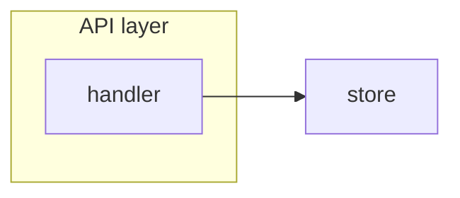

# Refined Epic Structure Reference

> The `issue-refine-loop` skill loads this before Phase 2 (Assess) and keeps it loaded through
> Phase 4 (Refine). It defines the canonical section set and ordering, the completeness rubric in
> full, EARS syntax, persona/value/task anatomy, diagram requirements, and the severity scale.

## Where the Quality Bar Comes From — and Which Source Wins

Two sources define "refined". They govern different things.

| Source | Governs | Status |
| --- | --- | --- |
| The repository's gold-standard refined epic | **Structure**: which sections exist and in what order | Authoritative for structure |
| `feature-to-plan/references/spec-format.md` | **Format**: EARS syntax, persona template, value assessment, task anatomy, Mermaid diagram requirements | Authoritative for format |

**Precedence rule:** where the two disagree on presentation — for example whether personas are a
table or a per-persona template block — the gold-standard epic wins, and the run states in its
closing comment that it followed the epic over the format reference for that element.

The reference epic used to derive the section list below is
[`lousy-agents/coach#97`](https://github.com/lousy-agents/coach/issues/97) (*epic: Coach API
Platform — Baseline Scan*), read directly for this skill. Its personas are a table, which matches
`spec-format.md`, so no conflict is currently outstanding.

**On first run against a new repository**, re-derive structure from that repository's own best
refined epic when one exists, using this deterministic search order — the section set below is the
default, not a repo-invariant law:

1. An issue carrying both the `refined` label and the `<!-- issue-refine-loop:v1 -->` marker — the
   strongest signal, since a prior run of this skill already produced it.
2. Failing that, an issue titled with an `epic:` prefix (or whatever prefix convention the
   repository's other issues establish) whose body contains at least six of the eight canonical
   section headings below.
3. Neither found — use the section set below unchanged, and record in the closing comment that the
   tiebreaker was unavailable.

**Never invent the gold standard's contents.** A partial match under (2) only supplies structure,
never content.

## Canonical Section Set and Ordering

Derived from `lousy-agents/coach#97`. Keep the identities and the order. Cosmetic title variation is
allowed only when the target repository has an established convention; never drop a section.

```markdown
<!-- issue-refine-loop:v1 -->

# Feature: <name>

## Problem Statement

## Personas

## Value Assessment

## User Stories

### Story 1: <title>
#### Acceptance Criteria
#### Notes

---

## Design

### Alignment with <the repo's architecture doc>   <- include when such a doc exists
### Components Affected
### Dependencies
### Data Model Changes
### Diagrams
### Decisions                                       <- include when the epic settles a trade-off
### Open Questions

---

## Tasks

## Out of Scope

## Future Considerations
```

Notes drawn from the reference epic:

- `## Tasks` in the epic body may be a **link list to child issues** rather than inline task detail,
  with a one-line explanation that per-task Objective / Context / Affected files / Requirements /
  Verification / Done-when detail lives in each child. This is the intended shape once Phase 5 has
  created children, and it is what keeps the body inside the 65,536-character limit.
- `### Open Questions` lives inside `## Design`; `## Future Considerations` is top-level. Resolved
  questions stay in the list marked `[x]` with the decision recorded inline, rather than deleted.
- `### Decisions` is a table of Question / Decision / link-to-rationale. Add it when the refinement
  settled a trade-off; omit it when nothing was decided.
- The epic closes with a provenance footer stating where the body came from and what review it
  passed.

## The Completeness Rubric in Full

The eight-row table in `SKILL.md` is the rubric. This section defines `present` vs `missing`
precisely so two runs score the same body identically.

**1. Problem Statement** — `present` when it states the problem and its consequence in two or more
sentences and proposes no solution. `missing` when it is one sentence, restates the title, or
describes the fix ("add a semgrep rule") rather than the harm ("TOCTOU races ship undetected").

**2. Personas** — `present` when a table has at least one row, each row names a **role**, not a
person, and each row carries an explicit `Positive` / `Negative` / `Neutral` impact. `missing` when
impact is implied rather than stated, or when a persona is a named individual.

**3. Value Assessment** — `present` when a primary value type is named from
{Commercial, Future, Customer, Market, Efficiency} with a one-line reason. Secondary is optional.
`missing` when value is asserted without a type, or the type appears with no reason.

**4. User Stories** — `present` when all three hold: at least one story in As-a / I-want / so-that
form; **every** story carries at least one acceptance criterion in an EARS pattern; and at least one
criterion across the whole section covers an error or unwanted condition. `missing` when any story
has zero EARS criteria, or when every criterion describes only the happy path.

**5. Design** — `present` when all four hold: components affected are listed with concrete
repository paths; dependencies are listed (external services, libraries, or sibling work);
data-model or state changes are described **or** explicitly stated as none; and at least one
Mermaid diagram is present. `missing` if any one of the four is absent — a Design block with
components and dependencies but no diagram scores `missing`, not partial.

**6. Tasks** — `present` when at least one task exists and each task either carries the full
six-part anatomy inline or links to a child issue that carries it. `missing` when tasks are bare
titles with no anatomy and no child link.

**7. Out of Scope** — `present` when at least one explicit exclusion is listed. `missing` when the
section is absent or says only "TBD". An epic with nothing excluded is almost always under-scoped;
if genuinely nothing is out of scope, say so explicitly and say why.

**8. Open Questions / Future Considerations** — `present` when the section exists and every
unresolved question carries a severity. `missing` when questions are listed without severity, since
the loop's exit condition and the `needs-human-input` terminal state both key off severity.

Report the result as eight verdicts plus the counts named in the `SKILL.md` table. That tuple is
what the loop converges on and what the closing comment records before and after.

## EARS Acceptance Criteria

Every acceptance criterion uses one of these six patterns.

| Pattern | Template | Use when |
| --- | --- | --- |
| Ubiquitous | The `<system>` shall `<response>` | Always true, no trigger |
| Event-driven | When `<trigger>`, the `<system>` shall `<response>` | Responding to an event |
| State-driven | While `<state>`, the `<system>` shall `<response>` | Active during a condition |
| Optional | Where `<feature>` is enabled, the `<system>` shall `<response>` | Configurable capability |
| Unwanted | If `<condition>`, then the `<system>` shall `<response>` | Error handling, edge cases |
| Complex | While `<state>`, when `<trigger>`, the `<system>` shall `<response>` | Combined conditions |

A criterion is testable only if it names an actor or system, a trigger or condition, and an
observable response. Reject criteria built on subjective verbs — improve, optimize, support,
handle, robust, seamless, intuitive, appropriate, fast, efficient, better — and rewrite them into a
pattern above with a measurable response. Split any criterion that bundles two independent
behaviors.

## Story, Persona, and Value Anatomy

```markdown
### Story 1: <Concise Title>

As a **<persona>**,
I want **<capability>**,
so that I can **<outcome>**.

#### Acceptance Criteria

- When <trigger>, the <system> shall <response>
- If <error condition>, then the <system> shall <response>

#### Notes

<Context, constraints, or deferred decisions>
```

```markdown
## Personas

| Persona | Impact | Notes |
| ------- | ------ | ----- |
| <role>  | Positive/Negative/Neutral | <how they are affected> |

## Value Assessment

- **Primary value**: <Commercial|Future|Customer|Market|Efficiency> — <reason>
- **Secondary value**: <type> — <reason>
```

Name personas by role, not by individual. Cover who benefits, who is disrupted, and who must change
behavior. Pull role names from the repository's own product materials when they exist.

## Task Anatomy for Child Issues

Each Task becomes one child issue body:

```markdown
**Objective**: <one action-oriented sentence>

**Context**: <why this task exists, what it unblocks>

**Affected files**:

- `<path/to/file>`

**Requirements**:

- <the specific acceptance criterion this task satisfies>

**Verification**:

- [ ] <command the implementer runs, using the repo's own commands>
- [ ] <observable condition that must hold>

**Done when**:

- [ ] All verification steps pass
- [ ] Acceptance criteria <references> satisfied
- [ ] Code follows the repo's engineering guidance

---
Parent: owner/repo#N
```

Sizing: one task should be completable in a single coding-agent session — roughly one to three
files. State dependencies explicitly as `Depends on: <task title>`. Write every checkbox unchecked;
only the implementer marks them. Use the repository's own test and lint commands in Verification —
never a command the repository does not define.

## Diagram Requirements

At least one Mermaid diagram is required for Design to score `present`. Prefer a `flowchart LR` or
`flowchart TB` for data flow, and add a `sequenceDiagram` when interaction ordering carries the
design. Use `stateDiagram-v2` for lifecycle work and `erDiagram` for data-model work.

````markdown

````

Group related nodes with subgraphs by architectural layer, label every node, and keep the diagram
consistent with the prose — a diagram that contradicts the text is a Blocker, because an agent will
pick one and silently ignore the other.

## Severity Scale

The same scale the audit rubric uses. The refinement loop exits when no Blocker and no High finding
remains; Medium and Low findings are carried into Open Questions with their severity attached.

- **Blocker** — the epic is not safely implementable; an agent could build the wrong thing or
  cannot verify completion.
- **High** — likely implementation failure: serious ambiguity, a contradiction between sections, a
  missing dependency, or an untestable acceptance criterion.
- **Medium** — a gap that may cause rework or inconsistent implementation.
- **Low** — clarity or hygiene; unlikely to block implementation.

## Review Passes

When `spec-auditor` is present, load its `references/audit-rubric.md` and run its passes. When it is
not, run these as role-scoped reasoning passes and assign severities from the scale above:

1. **Internal consistency** — contradictions across problem, stories, criteria, design, tasks, and
   out-of-scope; diagrams disagreeing with prose; out-of-scope items reappearing in tasks.
2. **Completeness of behavior** — missing error, empty, timeout, retry, rollback, first-run,
   migration, permission, or observability paths.
3. **EARS and acceptance-criteria quality** — untestable, subjective, or bundled criteria; no
   negative condition anywhere.
4. **Scope and increment boundaries** — more than one feature hidden in the epic; tasks larger than
   one agent session; missing dependencies between tasks.
5. **Architecture and repo fit** — referenced paths, packages, or commands that do not exist;
   conflict with the repository's own engineering guidance; invented patterns where an existing one
   applies.
6. **Verification and done criteria** — no repo-specific commands; verification that restates the
   requirement instead of saying how to check it; no mapping from tasks to acceptance criteria.
7. **Agent-instruction robustness** — undefined files, missing order of operations, "best
   practices" with no repo-specific meaning, no explicit stop conditions when assumptions fail.
