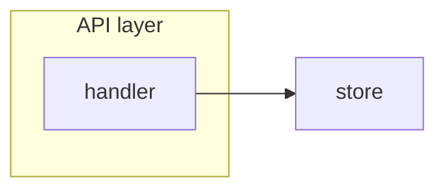

# Refined Epic Structure Reference

> The `issue-refine-loop` skill loads this before Phase 2 (Assess) and keeps it loaded through
> Phase 4 (Refine). It defines the canonical section set and ordering, the completeness rubric in
> full, the EARS Contract, persona/value/task anatomy, diagram requirements, and the severity scale.

## Where the Quality Bar Comes From — and Which Source Wins

Three sources define "refined". They govern different things.

| Source | Governs | Status |
| --- | --- | --- |
| The repository's gold-standard refined epic | **Structure**: which sections exist and in what order | Authoritative for structure |
| `feature-to-plan/references/spec-format.md` | **Format**: persona template, value assessment, task anatomy, Mermaid diagram requirements | Authoritative for format |
| `to-ears/references/ears-contract.md` (mirrored verbatim below) | **Acceptance criteria**: EARS patterns, criterion IDs and provenance, Open Question entries, verification tagging | Authoritative for criteria; the gold-standard epic does not override it |

**Precedence rule:** where the structure source and the format source disagree on presentation — for example whether personas are a
table or a per-persona template block — the gold-standard epic wins, and the run states in its
closing comment that it followed the epic over the format reference for that element.

The reference epic used to derive the section list below is
[`lousy-agents/coach#97`](https://github.com/lousy-agents/coach/issues/97) (*epic: Coach API
Platform — Baseline Scan*), read directly for this skill. Its personas are a table, which matches
`spec-format.md`, so no conflict is currently outstanding. It predates criterion IDs and provenance
tags. Those come from the EARS Contract, which the gold-standard epic does not override.

**On first run against a new repository**, re-derive structure from that repository's own best
refined epic when one exists, using this deterministic search order — the section set below is the
default, not a repo-invariant law:

1. An issue carrying both the `refined` label and the `<!-- issue-refine-loop:v1 -->` marker — the
   strongest signal, since a prior run of this skill already produced it.
2. Failing that, an issue titled with an `epic:` prefix (or whatever prefix convention the
   repository's other issues establish) whose body contains at least six of the eight canonical
   section headings below. A `feature-to-plan`-authored issue matches this tier by structure
   only — it is a drafted plan, not a refined epic; copy its heading set, not a `refined` verdict.
3. Neither found — use the section set below unchanged, and record in the closing comment that the
   tiebreaker was unavailable.

**Never invent the gold standard's contents.** A partial match under (2) only supplies structure,
never content.

## Canonical Section Set and Ordering

Derived from `lousy-agents/coach#97`. Keep the identities and the order. Cosmetic title variation is
allowed only when the target repository has an established convention; never drop a section.

```markdown
<!-- issue-refine-loop:v1 -->

# Feature: <name>

## Problem Statement

## Personas

## Value Assessment

## User Stories

### Story 1: <title>
#### Acceptance Criteria
#### Notes

---

## Design

### Alignment with <the repo's architecture doc>   <- include when such a doc exists
### Components Affected
### Dependencies
### Data Model Changes
### Diagrams
### Terms and States                                <- include when criteria use defined states or thresholds (skill addition)
### Decisions                                       <- include when the epic settles a trade-off
### Open Questions

---

## Tasks

## Issue Graph Manifest                              <- added by Phase 5 once child issues exist

## Out of Scope

## Future Considerations
```

Notes drawn from the reference epic:

- `## Tasks` in the epic body may be a **link list to child issues** rather than inline task detail,
  with a one-line explanation that per-task Objective / Context / Affected files / Requirements /
  Verification / Done-when detail lives in each child. This is the intended shape once Phase 5 has
  created children, and it is what keeps the body inside the 65,536-character limit.
- `### Open Questions` lives inside `## Design`; `## Future Considerations` is top-level. Resolved
  questions stay in the list marked `[x]` with the decision recorded inline, rather than deleted.
- `### Decisions` is a table of Question / Decision / link-to-rationale. Add it when the refinement
  settled a trade-off; omit it when nothing was decided.
- The epic closes with a provenance footer stating where the body came from and what review it
  passed.
- `### Terms and States` is a skill addition that supports the EARS Contract, not an element derived
  from the reference epic. Include it when criteria name states or thresholds that need a definition.
- `## Issue Graph Manifest` is a v1 addition to this skill, not a structural element re-derived from
  any repository's gold-standard epic. An older reference epic — including the one used to derive
  the section list above — predates this section and won't contain it; treat that absence as
  expected, not as evidence the section should be dropped. See "Issue Graph Manifest Anatomy" below
  for its content, and the Closing Comment Contract in
  [`github-surface.md`](./github-surface.md) for the machine-parseable form the manifest summarizes.

## The Completeness Rubric in Full

The eight-row table in `SKILL.md` is the rubric. This section defines `present` vs `missing`
precisely so two runs score the same body identically.

**1. Problem Statement** — `present` when it states the problem and its consequence in two or more
sentences and proposes no solution. `missing` when it is one sentence, restates the title, or
describes the fix ("add a semgrep rule") rather than the harm ("TOCTOU races ship undetected").

**2. Personas** — `present` when a table has at least one row, each row names a **role**, not a
person, and each row carries an explicit `Positive` / `Negative` / `Neutral` impact. `missing` when
impact is implied rather than stated, or when a persona is a named individual.

**3. Value Assessment** — `present` when a primary value type is named from
{Commercial, Future, Customer, Market, Efficiency} with a one-line reason. Secondary is optional.
`missing` when value is asserted without a type, or the type appears with no reason.

**4. User Stories** — `present` when all three hold: at least one story in As-a / I-want / so-that
form; **every** story carries at least one acceptance criterion in an EARS pattern; and at least one
criterion across the whole section covers an error or unwanted condition. `missing` when any story
has zero EARS criteria, or when every criterion describes only the happy path.

Three counting rules keep two runs on the same body in agreement:
- A `[non-EARS: …]` criterion is not an EARS criterion.
- An error criterion counts when its unwanted condition is written out, whether tagged `[src]` or
  `[inferred]`. A `[TBD …]` inside its *response* does not disqualify it, because the `refined` gate
  catches that TBD separately.
- A criterion whose unwanted *condition* is itself `[TBD …]` does not count. Do not invent an error
  criterion to pass the row. An open error behavior stays an Open Question, and the row stays
  `missing` until a human resolves it.

**5. Design** — `present` when all four hold: components affected are listed with concrete
repository paths; dependencies are listed (external services, libraries, or sibling work);
data-model or state changes are described **or** explicitly stated as none; and at least one
Mermaid diagram is present. `missing` if any one of the four is absent — a Design block with
components and dependencies but no diagram scores `missing`, not partial.

**6. Tasks** — `present` when at least one task exists and each task either carries the full
six-part anatomy inline or links to a child issue that carries it. `missing` when tasks are bare
titles with no anatomy and no child link.

**7. Out of Scope** — `present` when at least one explicit exclusion is listed. `missing` when the
section is absent or says only "TBD". An epic with nothing excluded is almost always under-scoped;
if genuinely nothing is out of scope, say so explicitly and say why.

**8. Open Questions / Future Considerations** — `present` when the section exists and every
unresolved question carries a severity. `missing` when questions are listed without severity, since
the loop's exit condition and the `needs-human-input` terminal state both key off severity.

Report the result as eight verdicts plus the counts named in the `SKILL.md` table. That tuple is
what the loop converges on and what the closing comment records before and after.

`## Issue Graph Manifest` is deliberately not a ninth scored row. The Phase 2/Phase 4 loop converges
*before* Phase 5 creates any child, so a rubric row that required the manifest to exist would never
be satisfiable at the point the loop checks it. Phase 5 writes the manifest unconditionally once
children exist; Phase 6 verifies it lists every current child as a one-time gate on the `refined`
terminal state instead (see `SKILL.md` Phase 6), which avoids the circularity while still keeping the
check mandatory.

## EARS Acceptance Criteria

The block below is a verbatim copy of the EARS Contract owned by the `to-ears` skill. When `to-ears`
is installed, call it in Embedded mode during Phase 4: `draft` to write criteria, `review` for
findings, `test map` for child Verification. Otherwise apply this block directly.

- **Inferences stay open within a run.** Criteria are drafted in Phase 4, after the Phase 3 approval
  point, so nobody confirms an inference inside the loop. An inferred criterion keeps its
  `[inferred: OQ-n]` tag and its Open Question; never upgrade it to `[src: …]` on your own authority.
  A human resolves it on the issue afterward.
- **Rubric row 4** follows the counting rules in the rubric above.
- **The `refined` gate** treats any remaining `[TBD …]` clause, and any Blocker or High Open
  Question, as a remaining Blocker or High finding. A finding that only a human decision can fix
  goes straight to `needs-human-input`; do not spend loop rounds trying to fix it.
- **Legacy epics.** An epic refined before criteria carried IDs gets IDs and provenance tags on its
  next run. A legacy criterion with no traceable source becomes `[inferred]`. That can move the epic
  from `refined` to `needs-human-input`, which is the honest outcome.

<!-- ears-contract:begin -->
**EARS Contract v1.** This block is copied verbatim from the `to-ears` skill's `references/ears-contract.md`, so the skill that carries it still works when installed alone. Do not edit this copy by itself.

When `to-ears` is installed, use it to draft and review criteria and to derive tests from them. Either way, this block is the minimum every consumer enforces.

**Patterns.** Each criterion uses one of five patterns, or one of the combinations listed below the table.

| Pattern | Template | Use when |
| --- | --- | --- |
| Ubiquitous | The `<system>` shall `<response>`. | The response is required at all times within the system's scope. Do not use it just because the source named no trigger. |
| Event-driven | When `<optional precondition>` `<trigger>`, the `<system>` shall `<response>`. | A wanted event at the system boundary activates the response. |
| Unwanted behavior | If `<optional precondition>` `<unwanted condition>`, then the `<system>` shall `<response>`. | A fault, invalid or unexpected input, misuse, or dependency failure needs a response. A boundary value of wanted behavior is not unwanted behavior. |
| State-driven | While `<state>`, the `<system>` shall `<response>`. `During` may replace `While`. | The response is required for as long as a defined runtime state holds. |
| Optional feature | Where `<feature>` is included, the `<system>` shall `<response>`. | The response applies only to product variants or deployments that include the feature. A runtime mode or flag state is a state, so use `While` for it. |

Combinations keep the clause order Where → While → When/If:

- `While <state>, when <trigger>, the <system> shall …`
- `While <state>, if <unwanted condition>, then the <system> shall …`
- `Where <feature> is included, when <trigger>, the <system> shall …`

Split a combination into linked criteria when it stops being easy to parse.

Choose the pattern from the behavior. Identify the response first, then what activates it. Never choose a pattern because a word such as "if" or "when" appears in the source text.

**Criterion line.** Write each criterion as `- AC-<story>.<n>: <EARS sentence> [<provenance>]`.

- IDs are unique within the artifact.
- Once anything cites an ID, never renumber it.
- When the source has its own identifiers, keep them and record the mapping.

Each criterion ends with exactly one provenance tag:

- `[src: <issue #, doc path, or "user">]`: the source states it, or the user confirmed it.
- `[inferred: OQ-<n>]`: the agent's interpretation, grounded in evidence it can cite, such as the source's wording or an existing repo convention. It is not settled until OQ-<n> is answered.

`[src]` covers the whole sentence as written. If you chose a part the source does not state, such as the responding component or the scope, tag the criterion `[inferred]` or mark that part `[TBD …]`. An open OQ that questions a part you left looking settled is a contradiction. When two criteria conflict, mark the conflicting part of each inline with `[TBD: conflicts with AC-… — OQ-<n>]`.

Two markers can appear in addition to that tag. Neither one replaces it.

- `[TBD: <decision needed> — OQ-<n>]`: written inline, in place of a value or clause that no evidence supports.
- `[non-EARS: <reason>]`: placed just before the provenance tag. It is a rare exception for content that no pattern fits, such as a data format. Never use it for a vague criterion.

Examples:

- `- AC-2.1: If a reset link is presented more than 60 minutes after it was issued, then the reset service shall reject it with HTTP 410. [src: #47]`
- `- AC-2.2: When a reset completes, the reset service shall send a confirmation email to the account holder. [inferred: OQ-2]`
- `- AC-2.3: While the mail provider is unavailable, the reset service shall retry delivery for [TBD: retry window — OQ-3]. [src: #47]`

**Binding rules.**

1. **Never invent.** Add no value, threshold, trigger, precondition, exclusion, or behavior that the source or the user did not establish.
   - To make a criterion testable, mark the gap with `[TBD …]` and escalate it. Never fill in a plausible number.
   - Current code behavior is evidence of what exists, not of what is intended.
2. **One obligation per criterion.** Name the responding system or component the same way every time. Do not write "it", and do not switch subjects between lines.
3. **The response is observable.** State units, inclusive or exclusive boundaries, time windows, and the recipient or surface whenever they change the expected result. A vague term (see the list below) needs a measurable definition or a `[TBD …]`.
4. **A positive rule does not imply its negation.** "When an authorized device connects, … allow" says nothing about unauthorized devices.
   - Write the complement only when a source or the user establishes it. Otherwise open an OQ.
   - A `shall not` criterion needs a decidable pass/fail check.
5. **State behavior, not design,** unless the design is an approved constraint. An internal flag or log line is not the user-visible outcome unless it is the agreed proxy for it.
6. **Keep applicability in the criterion.** A condition that changes when a criterion applies belongs in the criterion, not in surrounding notes or prose.
7. **Sweep for omissions before drafting is finished.** Check each of these:
   - invalid, unauthorized, or malformed input
   - missing, stale, or corrupt data
   - dependency failure
   - startup, degraded, recovery, and shutdown states
   - boundaries
   - repeated or concurrent events
   - logging, alerting, and fallback

   Give each relevant prompt a disposition:
   - covered (`AC-…`)
   - confirmed by the user (a criterion tagged `[src: user]`)
   - out of scope (with a reason, listed with the artifact's exclusions)
   - unresolved (`OQ-…`)

   The sweep prompts investigation. It does not license writing criteria.
8. **EARS shape is not quality.** A well-formed sentence can still be vague, wrong, compound, or untestable. Review meaning, not form.

**Open questions.** Write each as `- [ ] OQ-<n> (<severity>; question | assumption): <text> — affects: AC-…, Task …; decision needed from: <role>`. When a question is answered, mark it `[x]` and record the decision inline.

Severity levels:

- **Blocker:** the work is not safely implementable. An agent could build the wrong thing, or cannot verify completion.
- **High:** likely implementation failure: serious ambiguity, a contradiction between sections, a missing dependency, or an untestable criterion.
- **Medium:** a gap that may cause rework or inconsistent implementation.
- **Low:** clarity or hygiene, unlikely to block implementation.

Two rules set minimum severities:

- A `[TBD …]` that leaves a criterion with no decidable expected result makes its OQ at least **High**.
- An `[inferred …]` assumption's OQ is at least **Medium**.

**Verification.** Each criterion has an oracle: a setup, a stimulus, and an observable expected result.

Cover these cases for each pattern:

- **Event-driven:** the response occurs when the trigger fires with preconditions held. A criterion does not say the response must be absent without its trigger (rule 4). Assert that as conformance only where another criterion states it; otherwise label it `(exploratory)`.
- **Unwanted behavior:** induce the condition and check the mitigation.
- **State-driven:** the response holds during the state. Also cover entering and leaving the state.
- **Optional feature:** the response in a configuration that includes the feature.
- **Combinations:** the response is withheld when an applicability condition is false, only where a criterion states that. Otherwise the check is `(exploratory)`.

Tag each verification item with the criterion IDs it exercises. Otherwise label it `(exploratory)`, `(structural)`, or `(gate)`; use `(gate)` for repo-wide lint and test commands.

A passing suite or a coverage number does not show that a criterion is met.

**Vague terms.** appropriate, as needed, better, easy, efficient, fast, handle, improve, intuitive, normally, optimize, quickly, robust, safe, seamless, secure, simple, sufficient, support, unacceptable, user-friendly
<!-- ears-contract:end -->

## Story, Persona, and Value Anatomy

```markdown
### Story 1: <Concise Title>

As a **<persona>**,
I want **<capability>**,
so that I can **<outcome>**.

#### Acceptance Criteria

- AC-1.1: When <trigger>, the <named component> shall <response>. [src: <issue or doc>]
- AC-1.2: If <unwanted condition>, then the <named component> shall <response>. [inferred: OQ-1]

#### Notes

Omission sweep: <prompt> → AC-1.2; <prompt> → OQ-2; <prompt> → out of scope (<reason>)
<Context, deferred decisions, or a pattern-choice rationale. Never a condition that changes when a criterion applies.>
```

```markdown
## Personas

| Persona | Impact | Notes |
| ------- | ------ | ----- |
| <role>  | Positive/Negative/Neutral | <how they are affected> |

## Value Assessment

- **Primary value**: <Commercial|Future|Customer|Market|Efficiency> — <reason>
- **Secondary value**: <type> — <reason>
```

Name personas by role, not by individual. Cover who benefits, who is disrupted, and who must change
behavior. Pull role names from the repository's own product materials when they exist.

## Task Anatomy for Child Issues

Each Task becomes one child issue body:

```markdown
**Objective**: <one action-oriented sentence>

**Context**: <why this task exists, what it unblocks>

**Affected files**:

- `<path/to/file>`

**Requirements**:

- AC-1.1: <criterion text copied verbatim from the epic, so the child stands alone>

**Verification**:

- [ ] (AC-1.1) <observable condition that must hold, with its oracle>
- [ ] (gate) <command the implementer runs, using the repo's own commands>

**Done when**:

- [ ] All verification steps pass
- [ ] AC-1.1 satisfied
- [ ] Code follows the repo's engineering guidance

---
Parent: owner/repo#N
```

Sizing: one task should be completable in a single coding-agent session — roughly one to three
files. State dependencies explicitly as `Depends on: <task title>`. Write every checkbox unchecked;
only the implementer marks them. Use the repository's own test and lint commands in Verification —
never a command the repository does not define.

## Issue Graph Manifest Anatomy

Written by Phase 5 in the same `update_issue_body` as the Tasks collapse, once at least one child
exists. Its purpose is narrow: let an agent that opens only the epic body — no issue-hierarchy read,
no `gh` CLI, no dependency-graph API access — see the full child set and its dependency edges
without a follow-up call.

```markdown
## Issue Graph Manifest

Parent epic: `owner/repo#N` (this issue). Dependency edges below are native GitHub blocking
relationships where the bound write path supports them, otherwise recorded as issue references
only — see this issue's most recent `issue-refine-loop closing comment` for the authoritative,
machine-parseable snapshot and which kind applies.

| Child issue | Status | Depends on |
| --- | --- | --- |
| owner/repo#M — <title> | open | owner/repo#K, owner/repo#J |
| owner/repo#M2 — <title> | open | — |
```

Rules:

- One row per child that currently exists for this epic — every child created this run, plus every
  child recorded by a prior run that a `read_issue` on this epic still confirms as a live child. A
  re-run appends or updates rows; it never drops a row for a child that still exists. Build or
  refresh the section whenever any child exists, including when this run created none.
- **Status** is `open` or `closed`, read at write time. This field goes stale the moment GitHub state
  changes after the write — it is a snapshot, not a live value — so do not treat it as authoritative
  for dispatch decisions; that is exactly what the closing comment's precedence note exists to say.
- **Depends on** lists blocker issues resolved to `owner/repo#N` (never a bare title) once the
  blocker's own issue exists. Prefer Phase 5's dependency wiring for children created this run; for
  children not created this run, take blockers from that child's body (`Depends on:` line) or from
  native blocking edges when the bound read path exposes them. A blocker capped or not yet created
  keeps its title-text form until it exists in a later run. Use `—` for no blockers.
- A child dropped by the 12-issue cap, or declined at the collision gate, gets no row and stays named
  only in the collapsed Tasks link list — the manifest describes issues that exist, not the full task
  list.
- Omit the whole section only when the epic still has no children at all.

## Diagram Requirements

At least one Mermaid diagram is required for Design to score `present`. Prefer a `flowchart LR` or
`flowchart TB` for data flow, and add a `sequenceDiagram` when interaction ordering carries the
design. Use `stateDiagram-v2` for lifecycle work and `erDiagram` for data-model work.

````markdown

```mermaid
flowchart LR
    subgraph API["API layer"]
        H["handler"]
    end
    H --> S["store"]
```
````

Group related nodes with subgraphs by architectural layer, label every node, and keep the diagram
consistent with the prose — a diagram that contradicts the text is a Blocker, because an agent will
pick one and silently ignore the other.

## Severity Scale

The same scale the audit rubric uses. The refinement loop exits when no Blocker and no High finding
remains; Medium and Low findings are carried into Open Questions with their severity attached.

- **Blocker** — the epic is not safely implementable; an agent could build the wrong thing or
  cannot verify completion.
- **High** — likely implementation failure: serious ambiguity, a contradiction between sections, a
  missing dependency, or an untestable acceptance criterion.
- **Medium** — a gap that may cause rework or inconsistent implementation.
- **Low** — clarity or hygiene; unlikely to block implementation.

## Review Passes

When `spec-auditor` is present, load its `references/audit-rubric.md` and run its passes. When it is
not, run these as role-scoped reasoning passes and assign severities from the scale above:

1. **Internal consistency** — contradictions across problem, stories, criteria, design, tasks, and
   out-of-scope; diagrams disagreeing with prose; out-of-scope items reappearing in tasks.
2. **Completeness of behavior** — missing error, empty, timeout, retry, rollback, first-run,
   migration, permission, or observability paths.
3. **EARS and acceptance-criteria quality** — untestable, subjective, or bundled criteria; no
   negative condition anywhere.
4. **Scope and increment boundaries** — more than one feature hidden in the epic; tasks larger than
   one agent session; missing dependencies between tasks.
5. **Architecture and repo fit** — referenced paths, packages, or commands that do not exist;
   conflict with the repository's own engineering guidance; invented patterns where an existing one
   applies.
6. **Verification and done criteria** — no repo-specific commands; verification that restates the
   requirement instead of saying how to check it; no mapping from tasks to acceptance criteria.
7. **Agent-instruction robustness** — undefined files, missing order of operations, "best
   practices" with no repo-specific meaning, no explicit stop conditions when assumptions fail.
